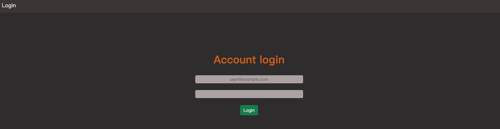

# AC-2-3-A13 Login

Login practice created by node.js and express.



## Features

- Login with eamil and password.

## How to use

1. Clone the Repo to local server.
```bash
    git clone https://github.com/paulwu-tw/shorten-url.git
```

2. Install need package by follow cmd.
```bash
    npm install
```

3. Start server for demo.
```bash
    npm run dev
```

4. While see the message below, open browser and enter the following URL. 
```bash
    Listen on http://localhost:3000
```

5. Stop server
```bash
    cmd + c
```

## Built with

- Node.js: 18.15.0
- Express: 4.18.2
- Express-handlebars: 7.0.7